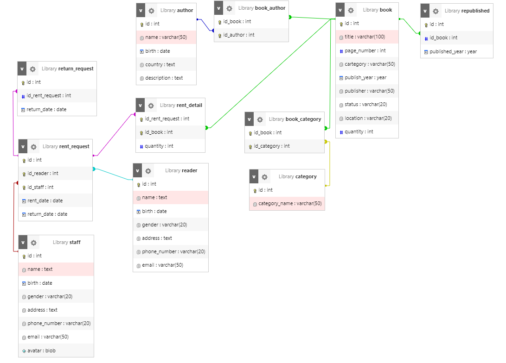
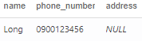
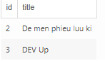
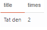
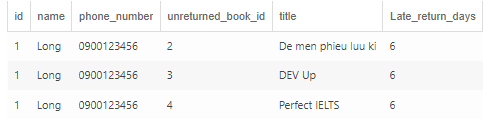

# I. Tạo cơ sở dữ liệu (Dùng lại cơ sở dữ liệu )

Tạo bảng và tạo liên kết

https://github.com/lommmm444556/lommmm444556.github.io/blob/master/Homework%20SQL/homework-3.md

Cơ sở dữ liệu trên em có thêm phần số lượng vào table book như cơ sở dự liệu dưới đây.

Em có sửa lại bảng sách thêm phần dữ liệu như cơ sở dữ liệu bên dưới



# II . Truy Vấn

1. Liệt kê danh sách độc giả đang mượn sách
```sql
SELECT name,phone_number,address from reader INNER join rent_request on rent_request.id_reader = reader.id INNER join return_request on return_request.id_rent_request= rent_request.id WHERE return_request.return_date IS null
```


2. Liệt kê các quyển sách thuộc thể loại bất kì
```sql 
SELECT book.id, title FROM book INNER join book_category on book_category.id_book = id 
INNER JOIN category on category.id = book_category.id_category WHERE category_name = 'truyen dai'
```



3. Đếm số lần tái bản quyển sách bất kì
```sql
SELECT title,COUNT(title) as times from book INNER join republished on republished.id_book = book.id WHERE book.title = 'tat den';
```



4. Liệt kê thông tin các độc giả mượn sách nhưng quá hạn trả và id, tên của quyển sách mà độc giả đó đang mượn
```sql
SELECT reader.id,name,phone_number,book.id as unreturned_book_id,book.title, Abs(datediff(rent_request.return_date,CURRENT_DATE)) AS Late_return_days from reader INNER join rent_request on rent_request.id_reader = reader.id INNER join return_request on return_request.id_rent_request= rent_request.id INNER JOIN rent_detail on rent_detail.id_rent_request = rent_request.id INNER join book on book.id = rent_detail.id_book WHERE return_request.return_date is null AND datediff(rent_request.return_date,CURRENT_DATE) < 0
```

