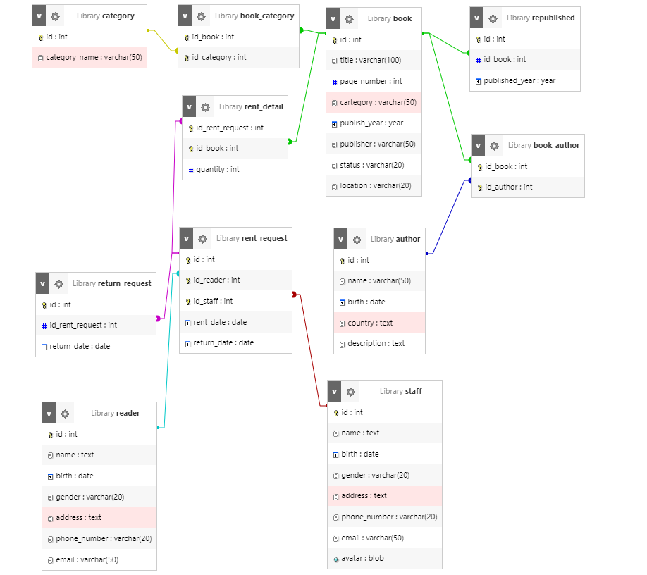

1. Tạo ra cơ sở dữ liệu thư viện
```sql
CREATE DATABASE Library;
```
2. Tạo bảng

2.1 Tạo bảng sách
```sql
CREATE TABLE book(
    id int PRIMARY KEY ,
    title varchar(100) NOT NULL,
  	page_number int, 
    cartegory varchar(50),
    publish_year year,
    publisher varchar(50),
    status varchar(20),
    location varchar(20)
    )
```
2.2 Tạo bảng thể loại
```sql
CREATE TABLE category(
    id int PRIMARY KEY,
    category_name varchar(50) NOT NULL
)
```
2.3 Tạo bảng sách thể loại
```sql
CREATE TABLE book_category(
    id_book int ,
   	id_category int ,
    FOREIGN KEY(id_book) REFERENCES book(id),
    FOREIGN KEY(id_category) REFERENCES category(id)
)
```
##### cập nhật khóa chính cho 2 id
```sql
ALTER TABLE `book_category` DROP PRIMARY KEY, ADD PRIMARY KEY(`id_book`, `id_category`);
```
2.4 Tạo bảng tác giả
```sql 
CREATE TABLE author(
  id INT PRIMARY KEY,
  name VARCHAR(50) NOT NULL,
  birth DATE,
  country TEXT,
  description TEXT  
)

```
2.5 Tạo bảng tái bản
```sql
CREATE TABLE republished (
id INT PRIMARY KEY,
id_book INT NOT NULL,
FOREIGN KEY (id_book) REFERENCES book(id),
published_year YEAR NOT NULL
)
```
2.6 Tạo bảng nhân viên
```sql
CREATE TABLE staff(
id INT PRIMARY KEY,
name TEXT NOT NULL,
birth DATE NOT NULL,
gender VARCHAR(20) NOT NULL,
address TEXT,
phone_number VARCHAR(20) NOT NULL,
email VARCHAR(50) NOT NULL,
avatar BLOB
)
```
2.7 Tạo bảng người đọc
```sql
CREATE TABLE reader(
id INT PRIMARY KEY,
name TEXT NOT NULL,
birth DATE NOT NULL,
gender VARCHAR(20),
address TEXT,
phone_number VARCHAR(20) NOT NULL,
email VARCHAR(50)
)
```
2.8 Tạo bảng yêu cầu mươn
```sql
CREATE TABLE rent_request(
id INT,
id_reader INT,
id_staff INT,
PRIMARY KEY (id, id_reader, id_staff),
FOREIGN KEY (id_reader) REFERENCES reader(id),
FOREIGN KEY (id_staff) REFERENCES staff(id),
rent_date DATE NOT NULL,
return_date DATE NOT NULL
)

```
2.9 Tạo bảng chỉ tiết mươn
```sql 
CREATE TABLE rent_detail(
id_rent_request INT,
id_book INT,
PRIMARY KEY(id_rent_request, id_book),
FOREIGN KEY (id_rent_request) REFERENCES rent_request(id),
FOREIGN KEY (id_book) REFERENCES book(id),
quantity INT NOT NULL
)

```
2.10 Tạo bảng phiếu trả(hạn trả)
```sql 
CREATE TABLE return_request(
id INT PRIMARY KEY,
id_rent_request INT,
FOREIGN KEY (id_rent_request) REFERENCES rent_request(id),
return_date DATE NOT NULL
)

```
3. Hình ảnh cở sở dữ liệu


